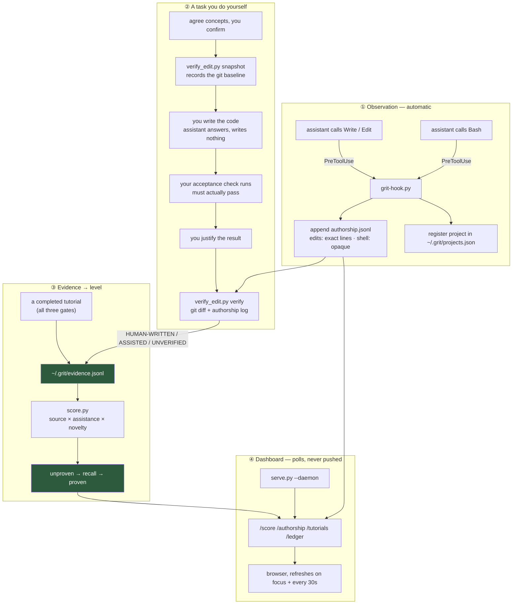

# Architecture

How grit actually works, end to end — **the mechanism**.

For the principles that constrain it and the limits it has not escaped, see [DESIGN.md](DESIGN.md). For individual decisions and what was rejected, see [`adr/`](adr/README.md).

---

## The one-sentence version

A hook watches who writes code, git says what changed, and a local daemon turns those two facts plus your own justification into a per-concept level you did not award yourself.

## Three processes, and they barely know each other

| Process | Lives for | Writes | Never does |
|---|---|---|---|
| **the hook** (`hooks/grit-hook.py`) | milliseconds, once per tool call | `~/.grit/projects/<key>/authorship.jsonl` | talk to the daemon, block an edit |
| **the assistant** (`skills/grit/SKILL.md`) | your session | evidence, via `score.py` | decide the check passed |
| **the daemon** (`skills/grit/serve.py`) | until stopped | `~/.grit/*` | run your acceptance check |

They are deliberately not coupled. The hook cannot depend on the daemon running, or every file edit would inherit the daemon's uptime. The daemon cannot depend on the hook, or a fresh machine could not render a dashboard. They meet through files.

## The files, and which one is the truth

Everything is JSON or JSONL on disk. There is no database and no server you do not control.

```
~/.grit/                             everything lives here — nothing in the project
  evidence.jsonl      append-only    THE SOURCE OF TRUTH for your score
  ledger.json         replace        tutorial sessions and their three gates
  sessions.json       replace, 0600  live tokens; survives a daemon restart
  preferences.json    replace        theme, callsign — configuration only
  projects.json       replace        which project paths have an authorship log
  daemon.json         replace        where the daemon is listening right now
  tutorials/          files          hand-authored tutorial pages

  projects/<key>/                    per project — raw observation, keyed by a
                                      hash of the project's real path
    authorship.jsonl  append-only    every byte the assistant wrote, here
    snapshots/<task>.json            the git baseline for one handover
    off               marker         killswitch for this project

  asked/              markers        one file per session already prompted
  .last-event         replace        2-second de-dup window for the hook
  hook-errors.log     append-only    the hook never raises; it logs and exits 0
  daemon.log          append-only    stdout/stderr when started with --daemon
```

Everything below `tutorials/` is scratch, not record: delete any of it and nothing about your score changes — including `projects/`, whose loss only means authorship history for those repos is gone, not your evidence or score.

**`evidence.jsonl` is the only file that matters.** The score is recomputed from it on every read and stored nowhere, so there is no cached number to go stale and nothing to edit into being true. Delete it and your score is genuinely gone; edit it and you have only lied to yourself.

The split is deliberate: **observations are keyed by project, proficiency is per person** — and both now live under `~/.grit/`, not inside the repository. Learning token buckets in one repository does not un-learn them in the next.

## The path a score takes



## The pieces

### `hooks/grit-hook.py` — the only un-arguable measurement

Runs as a `PreToolUse` command hook. Two jobs: append an authorship row, and ask once per session whether you would rather do it yourself.

Three properties it must never lose, each of which was once broken:

- **It cannot block an edit.** Python exits `2` when it cannot open a script, and `2` is exactly the code both runtimes read as *block this tool call*. Every registration is therefore `python3 '<path>' || exit 0` — see [ADR 0007](adr/0007-hooks-must-fail-open.md).
- **Shell calls are recorded as `opaque`, never as zero.** An assistant editing through `python3 - <<EOF` produces no edit event; recording nothing would let that read as human-written.
- **One event, one row.** Two registrations can match one edit (user-level plus project-level, or zrb reading Claude's settings). A 2-second content hash de-duplicates.

### `skills/grit/verify_edit.py` — who wrote it

Compares a git snapshot taken at handover against the tree now, and cross-references the authorship log.

| Verdict | Means | Scores as |
|---|---|---|
| `HUMAN-WRITTEN` | the tree changed, no assistant edits observed | `none` |
| `ASSISTED` | assistant edits landed in the window | `full` → zero credit |
| `NOTHING CHANGED` | the check passed without work | nothing recorded |
| `UNVERIFIED` | nobody was watching, or a shell ran unobserved | `full` |

The subtle one: **an absent authorship log is ambiguous.** No hook installed means nobody watched; a hook installed that recorded nothing means the assistant wrote nothing — which is the DIY case and *should* score. `doctor.is_watching()` distinguishes them. Conflating them made the first task in every fresh repository unscoreable.

### `skills/grit/score.py` — evidence → level

```
credit = source_weight × assistance × novelty     (capped, summed, max 1.0)
```

- **source** — repo `0.5`, sandbox `0.2`
- **assistance** — none `1.0`, partial `0.5`, full `0.0`
- **novelty** — `1/(1+repeats)`, hard-capped at `1.5 × weight` per distinct task

`proven` needs `≥ 0.80` **and two distinct unaided repository tasks**. Failures subtract `0.25`; evidence older than 90 days counts half.

A task's identity is `(source, project, task)` for repository work and `(source, task)` for tutorials — repository task ids are per-project sequences, so `001` in two repos is two tasks, while a tutorial is the same exercise wherever it runs. Full reasoning and the calibration errors that were caught by running it: [ADR 0009](adr/0009-graded-score-from-capped-evidence.md).

### `skills/grit/serve.py` — the daemon

Localhost only, no cross-origin. Three responsibilities: serve the dashboard and tutorials, own the three-gate ledger, and expose the score.

| Route | Returns |
|---|---|
| `/` | the dashboard (read from disk per request — no restart needed to edit it) |
| `/status` | everything `/grit` needs in one call, including the derived `notices` — a setting that switches the mechanism off is shown, never stored |
| `/score`, `/profile` | per-concept levels |
| `/authorship` | assistant-written lines per project |
| `/tutorials`, `/ledger`, `/preferences`, `/themes`, `/health` | as named |
| `POST /tutorial/<report-token>/{check,justification}` | gates 1 and 2 — the justification carries the user's `prediction` alongside their `answer`, so gate 3 judges both |
| `POST /judgment/<judge-token>` | gate 3 |

**Two credentials per session.** The page gets a *report* token and can only report gates 1 and 2. The *judge* token is printed to the daemon's terminal and never reaches the browser; `POST /tutorial/<report>/judgment` returns `403` on purpose. Without the split the page could award itself a pass with one `fetch()` — [ADR 0006](adr/0006-two-credentials-per-session.md).

**Gate 3 appends.** The first verdict stands; later calls return `409` with the standing verdict and the full history, and change nothing. A verdict you can overwrite is not evidence.

Editing `serve.py` needs a daemon restart. Editing `dashboard.html` does not.

### `skills/grit/dashboard.html` — a polling view

No build step, no framework, no dependencies. Themes are CSS variable blocks; adding one means a block here and a name in `THEMES`.

The concept grid is ordered by what needs work — unproven first, highest score first inside a level — and every card that is not `proven` carries the one sentence saying what would prove it, derived in `score.py` beside the level itself so the card and the arithmetic cannot disagree. Cards also count down to the point where their evidence starts halving, because ageing is the only way the score moves without the user failing anything.

It **polls**: the writer is a hook process that exits immediately and has nowhere to hold a connection, so files are the handoff and a 30-second timer plus a focus listener is the refresh. It also **degrades per panel** — one failing endpoint used to reject the whole `Promise.all` and blank every tile at its static zero, which made the product look entirely broken when one route was. Now a dead endpoint names itself in the header.

### `skills/grit/tutorial.template.html` — the page the assistant fills in

One file, no build step, no network beyond loopback. The check and the tool's own self-test are `text/plain` blocks evaluated together at worker scope, so the self-test can reach whatever the check defines and the user's code can never see the tests.

Three capabilities are declared by the authored check rather than switched on centrally, which is what keeps a tutorial written before any of them existed working unchanged:

| Declared by | Effect |
|---|---|
| `frames` on the check's return | the page renders a step-through above the result — `{label, cells, note}` per step, changed cells highlighted. Data only: the worker cannot hand the page markup |
| `IS_SOURCE_TEXT` at worker scope | the page stops requiring a JS function called `solve` and passes the textarea verbatim, so the exercise can be assembly, a query, a grammar. The *check* is still JS |
| the `PREDICTION` slot | a prediction asked before the first run and locked by it. It rides along with gate 2 and is judged with the answer — the one field on the page that cannot be written after seeing the result |

### The supporting scripts

- **`doctor.py`** — enumerates every place a hook registration can hide, resolves the script path, and *runs each command* to see whether it returns the blocking exit code. Ships inside the skill so `/grit` works without the repo.
- **`bin/install.sh`** — installs to 31 runtimes; wires hooks only where a `PreToolUse` mechanism exists (Claude Code, zrb). Merges config, never overwrites, backs up first, and **verifies its own work**: the daemon, scoring and hook self-checks must all pass or it exits non-zero. `check_docs.py` runs too, but only warns — drifted prose should not block an install.
- **`bin/_wire_hook.py`** — the two config shapes, kept out of the shell.

## Invariants

Break any of these and the record stops meaning anything. Each has a test, and each was once broken.

1. **`earned` is derived, never assigned** — all three gates present, check still passing, judgment sound. One function, one place.
2. **No raw credential enters the ledger.** `/ledger` is readable; rows carry an opaque `sid`.
3. **A failure is recorded, not swallowed.** A judged-unsound tutorial writes a failure event. It used to write nothing, so a failed attempt left an empty profile.
4. **`--failed` reaches the file.** It once mutated the returned dict *after* the write, so a recorded failure scored as a pass — raising the number it was meant to lower.
5. **A hook can never block an edit.**
6. **Gate 3 appends.**
7. **Every endpoint the dashboard fetches must answer.** The test derives the list from `dashboard.html` itself, so it cannot drift.

## Running the checks

```sh
python3 skills/grit/test_serve.py      # daemon integrity
python3 skills/grit/score.py selftest  # the scoring model
python3 hooks/test_hook.py             # the hook
python3 bin/test_study_report.py       # the retrospective study instrument
python3 skills/grit/doctor.py          # this machine's registrations
python3 bin/check_docs.py              # the docs against the code
```

No framework. Every case is a defect that actually shipped, and the comment says which — so a future edit that reintroduces one fails loudly instead of quietly re-earning concepts nobody earned.

## What is not built

**Automation around tutorials.** The runtime delivers and scores a tutorial, and the assistant writes one on demand from the template — both verified end to end. What does not exist is anything around that: no library, no cache across machines, no batching, and no validation of a page before it is served beyond the self-test embedded in it. Each tutorial is roughly 20 KB of hand-written HTML and JavaScript, so in practice most scores come from real repository tasks. The onboarding battery and the router are deferred — [ADR 0009](adr/0009-graded-score-from-capped-evidence.md) removed the need for them to exist before anything can be scored, and [ADR 0011](adr/0011-routing-on-a-measured-profile-deferred.md) records what they would be if built.

And the honest ceiling, unchanged: this may **avoid harm**. Whether a `proven` concept predicts real capability has never been tested. That study is [ADR 0012](adr/0012-profile-validity-is-the-critical-path.md), and it is still unrun.
