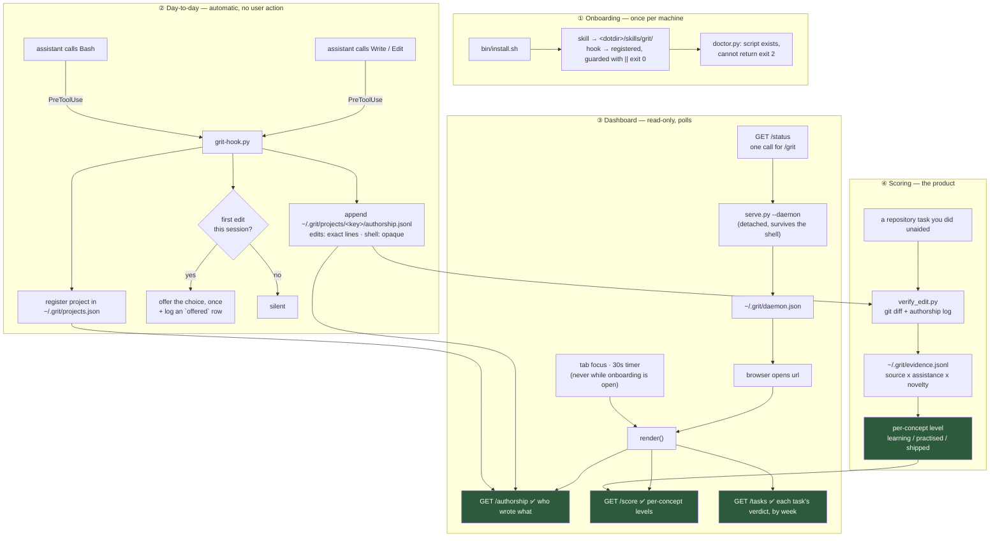

# ADR-0008: The dashboard polls files; nothing pushes, and the page leads with what works

## Status
Accepted

- **Date**: 2026-09-13 (revised 2026-09-16)
- **Deciders**: Go Frendi
- **Context tags**: dashboard, data-flow, ux, availability

## Context

Three separate processes write and read grit's state, and until now no document said how they connect. That gap produced real defects rather than confusion alone:

- The dashboard fetched the profile, ledger and tutorial endpoints — all three structurally empty at the time — and **never read `.grit/authorship.jsonl`**, the only file with data in it. The working feature was invisible on its own dashboard. (Since [ADR 0009](ADR-0009-graded-score-from-capped-evidence.md) the profile is fed by repository work and is no longer empty.)
- The page fetched once at load and never again, so it went stale the moment you started working.
- The daemon ran in the foreground of whatever shell started it and died with that shell, which meant closing a terminal 404'd your own data.
- The headline figure was a ring reading `0% proven+`, derived from a profile that nothing could populate until [ADR 0009](ADR-0009-graded-score-from-capped-evidence.md): before it, hand-written tutorials were the only evidence source, so a fresh installation showed an empty profile and the most prominent number on the page could never move.

## Decision

> The dashboard is a **poll-over-files view**. The hook appends to per-project JSONL, the daemon aggregates those files per request, and the page re-fetches on tab focus and every 30 seconds. Nothing pushes. The page leads with authorship — the measurement that exists — then the tasks you took on, then proficiency.

**Revised 2026-09-16 — the observation store left the repository.** The per-project files this ADR described as living in `<project>/.grit/` now live under `~/.grit/projects/<key>/`, where `<key>` is a hash of the project's real path. The decision to poll files and never push is unchanged; only the location of the files moved, so the split "observations are per project, proficiency is per person" no longer means "observations live inside your git repository." The old placement carried a tension it never named: encouraging projects to commit `.grit/` made an append-only record that can be edited a record that proves nothing, and the project's own policy forbids editing it. The only doc that advocated committing `.grit/` was a walkthrough of the original per-mission design; nothing in it survived, and it has been deleted (git keeps it). The old files are never migrated or deleted — an upgraded machine simply stops writing them, which is the decision-bearing part: the record continues uncompromised moving forward, and a wrong record is not repaired by editing the past (ADR 0003).

## The data path

## Rationale

- **Polling is correct for this shape.** The writer is a short-lived hook process that exits immediately; it has nowhere to hold a connection. Files are the natural handoff, and a 30-second refresh against a local file costs nothing.
- **`~/.grit/projects.json` is the missing link.** The log is per-project and the dashboard is per-person, so without a registry of projects the daemon cannot find the data. The hook writes that pointer as it records — now as the absolute real path, so the daemon re-derives the project key from wherever it was launched, and a symlink or relative spelling cannot resolve to a different directory there than it did in the hook.
- **Authorship leads because it is the only thing that works.** A layout that gives top billing to a permanently-zero metric tells the user the product is broken. `ADR 0001` said the dashboard is the entry gate; this makes the gate show something true.
- **An `offered` row makes the prompt mean something.** Sessions where the choice was offered and no assistant edit followed are the only evidence this product has that anyone chose to do the work. It is an inference, not an observation — the runtime does not report the answer back — and is labelled as such. The edit that *raised* the offer is flagged `prompted` and does not count as "followed": without that, every offered session contained an edit and the count was 0 on every machine. A `PostToolUse` registration now records an `applied` row when an edit really ran, so the approved-or-declined question is observed wherever it is installed and inferred only where it is not.

## Consequences
### Positive
- **`/status` exists so `/grit` costs one request**, not several shell round-trips.
- **The pre-2026-09-16 killswitch still works.** A `touch .grit/off` written under the old layout is honored indefinitely, so upgrading never silently re-enables a recording the user had deliberately stopped. `grit-hook.py --off` flips both markers, and `--on` clears the legacy one too — the switch must always do what the user last asked of it.
- **An empty panel says why it is empty.** A fresh install shows zeros; each panel names what would fill it, because a blank page reads as broken.
### Negative
- **Up to 30 seconds of staleness**, and none while the setup dialog is open — re-rendering under someone typing their name is worse than stale data.
- **`serve.py` must be restarted after editing it**; `dashboard.html` is read per request and needs no restart. This bit during development and is worth remembering.
- **`--daemon` detaches and `--stop` reads the pid from `daemon.json`.** A `kill -9` leaves that file pointing at a dead port, so readers must treat it as a hint.

## Alternatives Considered

- **Server-sent events from the daemon** — rejected. The daemon does not know when the hook wrote; it would have to watch the filesystem to push, which is strictly more machinery than a timer.
- **The hook POSTs to the daemon directly** — rejected. It would make every edit depend on the daemon being up, and the hook must never be able to interfere with editing (ADR 0007).
- **Hide the unbuilt panels entirely** — rejected; see Consequences.
- **Keep the ring, showing authorship as a percentage** — rejected. There is no denominator: the human's own edits are not observed. `verify_edit.py` gets a real one per task from git; the dashboard must not invent one.

## Implements Rules
- None — no rules are defined for this project yet.

## Verification
- `skills/grit/test_serve.py` — `_property_dashboard_endpoints_answer` (the list is derived from `dashboard.html`), `_property_port_is_published`, `_property_detached_daemon_starts_on_a_fresh_root`.
- `hooks/test_hook.py` — `_property_legacy_off_marker_still_silences`, `_property_off_switch_cli`.

## References

- [ADR index](README.md)
- [ADR 0010 — Proficiency decays](ADR-0010-proficiency-decays-with-inactivity.md)
- [ADR 0001 — Measure the effect](ADR-0001-measure-the-effect.md)
- [ADR 0007 — Hooks must fail open](ADR-0007-hooks-must-fail-open.md)
