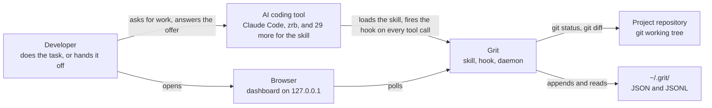
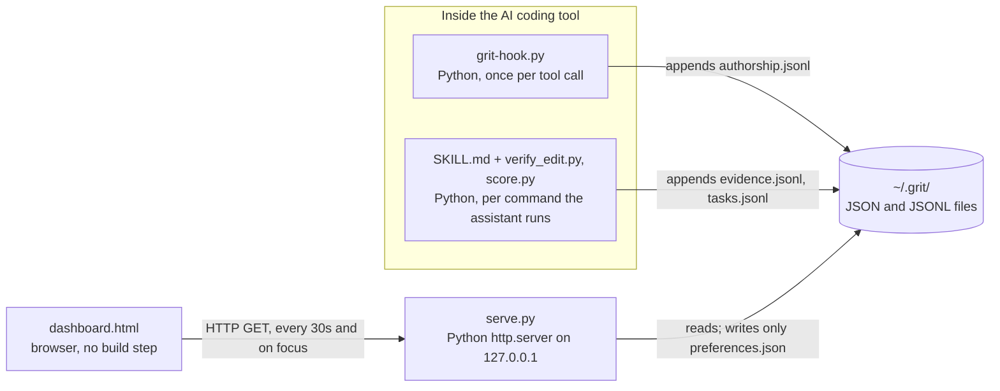
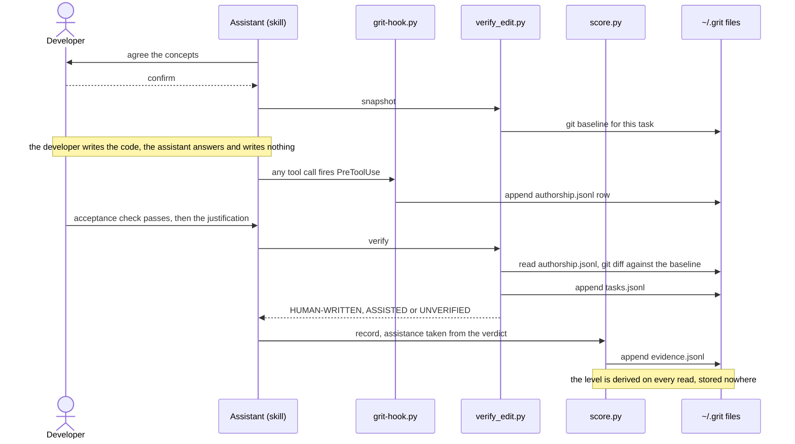
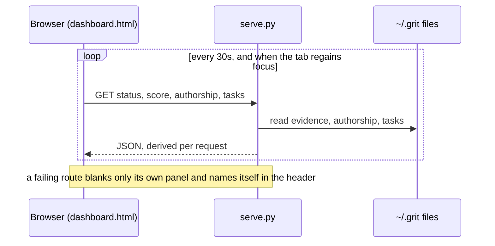

# Architecture: Grit

How grit actually works, end to end — **the mechanism**.

For the principles that constrain it and the limits it has not escaped, see [DESIGN.md](DESIGN.md). For individual decisions and what was rejected, see [`adr/`](adr/README.md).

**The one-sentence version:** a hook watches who writes code, git says what changed, and a local daemon turns those two facts plus your own justification into a per-concept level you did not award yourself.

## System Context



- **Developer** — chooses per task whether to do it themselves, and justifies the result. Nothing they say about their own skill is scored.
- **AI coding tool** — loads `skills/grit/SKILL.md` and runs the hook. The hook needs a `PreToolUse` mechanism, which only Claude Code and zrb have; everywhere else nobody is watching, so a task verifies as `UNVERIFIED`.
- **Project repository** — the work itself. Grit writes nothing into it: everything lives under `~/.grit/`.
- **Browser** — renders the dashboard from the local daemon. Nothing leaves the machine ([DESIGN.md §3](DESIGN.md#3-the-privacy-boundary)).

## Structure — Containers

Three separately running processes that barely know each other, and the files they meet through.



| Part | Technology | Lives for | Writes | Never does |
|------|-----------|-----------|--------|------------|
| **the hook** (`hooks/grit-hook.py`) | Python stdlib, `PreToolUse` / `PostToolUse` command hook | milliseconds, once per tool call | `~/.grit/projects/<key>/authorship.jsonl` | talk to the daemon, block an edit |
| **the assistant** (`skills/grit/SKILL.md`) | Markdown skill driving `verify_edit.py` and `score.py` | your session | evidence, via `score.py` | decide the check passed |
| **the daemon** (`skills/grit/serve.py`) | Python stdlib `http.server`, localhost only | until stopped | `~/.grit/preferences.json`, `daemon.json` | record evidence, or run your acceptance check |

They are deliberately not coupled. The hook cannot depend on the daemon running, or every file edit would inherit the daemon's uptime. The daemon cannot depend on the hook, or a fresh machine could not render a dashboard. They meet through files.

### Data stores — which file is the truth

Everything is JSON or JSONL on disk. There is no database and no server you do not control.

```
~/.grit/                             everything lives here — nothing in the project
  evidence.jsonl      append-only    THE SOURCE OF TRUTH for your score
  preferences.json    replace        theme, callsign, default choice — configuration only
  projects.json       replace        which project paths have an authorship log
  daemon.json         replace        where the daemon is listening right now

  projects/<key>/                    per project — raw observation, keyed by a
                                      hash of the project's real path
    authorship.jsonl  append-only    every byte the assistant wrote, here, plus offered/applied events
    tasks.jsonl       append-only    each verify_edit verdict, with git's line counts
    snapshots/<task>.json            the git baseline for one handover
    pending-shell/    markers        the tree before a shell call, until its PostToolUse
    off               marker         killswitch for this project

  asked/              markers        one file per session already prompted
  .last-event         replace        the hook's de-dup window (DEDUPE_WINDOW)
  hook-errors.log     append-only    the hook never raises; it logs and exits 0
  daemon.log          append-only    stdout/stderr when started with --daemon
```

Only `evidence.jsonl` is the record: delete anything else and your score does not change — losing `projects/` loses authorship history and task verdicts for those repos, not your evidence or score.

**`evidence.jsonl` is the only file that matters.** The score is recomputed from it on every read and stored nowhere, so there is no cached number to go stale and nothing to edit into being true. Delete it and your score is genuinely gone; edit it and you have only lied to yourself.

The split is deliberate: **observations are keyed by project, proficiency is per person** — and both now live under `~/.grit/`, not inside the repository. Learning token buckets in one repository does not un-learn them in the next.

## Components

### Scripts

| Component | Responsibility | Dependencies |
|-----------|---------------|-------------|
| `hooks/grit-hook.py` | Records authorship per tool call; offers once per session; the killswitch CLI (`--off` / `--on`) | none — installs apart from the skill |
| `skills/grit/verify_edit.py` | Snapshots the git baseline at handover; returns the verdict; appends `tasks.jsonl` | git, `authorship.jsonl`, `doctor.is_watching()` |
| `skills/grit/score.py` | Evidence → level; `record`, `show`, `concepts`, `level`, `selftest` | `evidence.jsonl` |
| `skills/grit/serve.py` | Serves the dashboard and read-only views; writes `preferences.json` | every file above, read-only |
| `skills/grit/dashboard.html` | Renders the views; polls | the daemon's routes |
| `skills/grit/doctor.py` | Finds and runs every hook registration on the machine | Claude Code and zrb config files |
| `bin/install.sh`, `bin/_wire_hook.py` | Installs the skill, wires the hook, verifies the install | bash 3.2, `doctor.py` |

### `hooks/grit-hook.py` — the only un-arguable measurement

Runs as a `PreToolUse` and `PostToolUse` command hook. Before a tool call it appends an authorship row and asks once per session whether you would rather do it yourself; after a file edit actually ran it appends an `applied` row.

Three properties it must never lose, each of which was once broken:

- **It cannot block an edit.** Python exits `2` when it cannot open a script, and `2` is exactly the code both runtimes read as *block this tool call*. Every registration is therefore `python3 '<path>' || exit 0` — see [ADR 0007](adr/ADR-0007-hooks-must-fail-open.md).
- **Shell calls are observed, and opaque until they are.** An assistant editing through `python3 - <<EOF` produces no edit event. Before each shell call the hook fingerprints `git status` (every listed path's size and mtime) under `pending-shell/<tool_use_id>`; after it, a `shell-result` row names the files that changed. `verify_edit.py` treats a call that wrote nothing as harmless, one that wrote files as the assistant's, and one with no result as unobserved (`UNVERIFIED`). A commit is not a write — content is untouched. Its own in-flight call is excused only when the command is a plain `verify_edit.py verify` invocation. Without this, the assistant running the user's tests, or running `verify_edit.py`, voided every task the skill handed over. Limits: only paths `git status` lists are seen, so a write to an ignored file is invisible; an unignored build artifact counts as the assistant's.
- **One event, one row.** Two registrations can match one edit (user-level plus project-level, or zrb reading Claude's settings). A content hash inside `DEDUPE_WINDOW` de-duplicates; the window is narrow on purpose, because a wider one swallowed real retries.

The row that raises the once-per-session offer is still recorded — `PreToolUse` fires before the user answers, so the edit may be approved — but it carries `prompted: true`. The daemon's `taken` count is "offered, and no file edit happened in that session" — no unprompted edit, and no `applied` row confirming the prompted one was approved. Shell calls do not count against it, since in DIY mode the assistant still runs the user's tests. On an install without the `PostToolUse` registration it falls back to an inference, and an approved prompted edit with nothing after it reads as taken.

### `skills/grit/verify_edit.py` — who wrote it

Compares a git snapshot taken at handover against the tree now, and cross-references the authorship log.

| Verdict | Means | Scores as |
|---|---|---|
| `HUMAN-WRITTEN` | the tree changed, no assistant edits observed | `none` |
| `ASSISTED` | assistant edits landed in the window | `full` → zero credit |
| `NOTHING CHANGED` | the check passed without work | nothing recorded |
| `UNVERIFIED` | nobody was watching, or a shell ran unobserved | `full` |

The subtle one: **an absent authorship log is ambiguous.** No hook installed means nobody watched; a hook installed that recorded nothing means the assistant wrote nothing — which is the DIY case and *should* score. `doctor.is_watching()` distinguishes them. Conflating them made the first task in every fresh repository unscoreable.

### `skills/grit/score.py` — evidence → level

`credit = source_weight × assistance × novelty`, capped per task, summed, max 1.0. The constants and the reasoning behind each are [ADR 0009](adr/ADR-0009-graded-score-from-capped-evidence.md)'s; the user-facing table is in the [README](../../README.md#the-score).

`suggest_mode` is the router: `score.py level <concept>...` pre-selects *guided* only for a concept still at `learning` with a recorded failure, and *solo* otherwise, because guidance goes only where a gap was measured ([ADR 0002](adr/ADR-0002-withhold-guidance-by-default.md)).

A task's identity is `(source, project, task)` — task ids are per-project sequences, so `001` in two repos is two tasks. Evidence rows from the removed tutorials say `"source": "sandbox"`; they stay in the append-only file, and `score_concept` skips any source it does not credit. Full reasoning and the calibration errors that were caught by running it: [ADR 0009](adr/ADR-0009-graded-score-from-capped-evidence.md).

### `skills/grit/serve.py` — the daemon

Localhost only, no cross-origin. It serves the dashboard and read-only views over the files the other tools write; its only write is `preferences.json`. It records no evidence.

| Route | Returns |
|---|---|
| `/` | the dashboard (read from disk per request — no restart needed to edit it) |
| `/status` | everything `/grit` needs in one call, including the derived `notices` — a setting that switches the mechanism off is shown, never stored |
| `/score`, `/profile` | per-concept levels |
| `/authorship` | assistant-written lines per project |
| `/tasks` | each handed-over task's latest verdict, with git's line counts, totals per verdict, and the last 8 weeks of verdicts |
| `/preferences`, `/themes`, `/health` | as named |
| `POST /preferences` | the one write — theme, callsign, motion, default choice |

Editing `serve.py` needs a daemon restart. Editing `dashboard.html` does not.

### `skills/grit/dashboard.html` — a polling view

No build step, no framework, no dependencies. Themes are CSS variable blocks; adding one means a block here and a name in `THEMES`.

The concept grid is ordered by what needs work — learning first, highest score first inside a level — and every card that is not `shipped` carries the one sentence saying what would prove it, derived in `score.py` beside the level itself so the card and the arithmetic cannot disagree. Cards also count down to the point where their evidence starts halving, because ageing is the only way the score moves without the user failing anything.

It **polls**: the writer is a hook process that exits immediately and has nowhere to hold a connection, so files are the handoff and a 30-second timer plus a focus listener is the refresh. It also **degrades per panel** — one failing endpoint used to reject the whole `Promise.all` and blank every tile at its static zero, which made the product look entirely broken when one route was. Now a dead endpoint names itself in the header.

### The supporting scripts

- **`doctor.py`** — enumerates every place a hook registration can hide, resolves the script path, and *runs each command* to see whether it returns the blocking exit code. Ships inside the skill so `/grit` works without the repo.
- **`bin/install.sh`** — installs to 31 runtimes; wires hooks only where a `PreToolUse` mechanism exists (Claude Code, zrb). Merges config, never overwrites, backs up first, and **verifies its own work**: the daemon, scoring and hook self-checks must all pass or it exits non-zero. `check_docs.py` runs too, but only warns — drifted prose should not block an install.
- **`bin/_wire_hook.py`** — the two config shapes, kept out of the shell.

## Key Decisions

| ADR | Title | Status |
|-----|-------|--------|
| [ADR-0001](adr/ADR-0001-measure-the-effect.md) | Measure the effect; make the invisible visible | Accepted |
| [ADR-0002](adr/ADR-0002-withhold-guidance-by-default.md) | Withhold guidance by default; grant it narrowly and adaptively | Accepted |
| [ADR-0003](adr/ADR-0003-repository-work-is-the-only-evidence.md) | Repository work is the only evidence; tutorials are removed | Accepted |
| [ADR-0007](adr/ADR-0007-hooks-must-fail-open.md) | A hook must fail open, and the guard belongs in the registration | Accepted |
| [ADR-0008](adr/ADR-0008-dashboard-polls-files-it-does-not-push.md) | The dashboard polls files; nothing pushes | Accepted |
| [ADR-0009](adr/ADR-0009-graded-score-from-capped-evidence.md) | A graded score, derived from capped evidence | Accepted |
| [ADR-0010](adr/ADR-0010-proficiency-decays-with-inactivity.md) | Proficiency decays with inactivity | Accepted |
| [ADR-0011](adr/ADR-0011-routing-on-a-measured-profile-deferred.md) | Routing on a measured profile, and why it is deferred | Accepted — partly built |
| [ADR-0012](adr/ADR-0012-profile-validity-is-the-critical-path.md) | Profile validity is the critical path | Accepted — unrun |

## Key Flows

### A task you do yourself — the path a score takes

The flow the product exists for. The two things readers get wrong are marked: the assistant never decides the check passed, and the verdict comes from the authorship log, not from what anyone says.



### The dashboard refresh

Where readers expect a push and there is none: the hook exits before any connection could be held, so files are the handoff ([ADR 0008](adr/ADR-0008-dashboard-polls-files-it-does-not-push.md)).



## Deployment

No servers. Nothing runs outside the developer's machine.

| Environment | Infrastructure | Strategy |
|-------------|---------------|----------|
| Developer machine | `bin/install.sh` copies the skill into each tool's skills directory and wires the hook for Claude Code and zrb; `serve.py --daemon` binds `127.0.0.1` | Upgrade = `git pull && bin/install.sh`; the installer runs the self-checks and exits non-zero if any fails |

There is no CI. The self-checks run by hand ([AGENTS.md §2](../../AGENTS.md#2-run-it-do-not-reason-about-it)) and inside the installer.

## Invariants

Break any of these and the record stops meaning anything. Each has a test, and each was once broken.

1. **A level is derived, never stored** — `score_concept`, on every read. One function, one place.
2. **`--failed` reaches the file.** It once mutated the returned dict *after* the write, so a recorded failure scored as a pass — raising the number it was meant to lower.
3. **A hook can never block an edit.**
4. **A shell call voids a task only if it was not observed.** One observed writing nothing is harmless; one observed writing files is the assistant's.
5. **Every endpoint the dashboard fetches must answer.** The test derives the list from `dashboard.html` itself, so it cannot drift.

What is deliberately not built is [DESIGN.md §2](DESIGN.md#2-scope).
