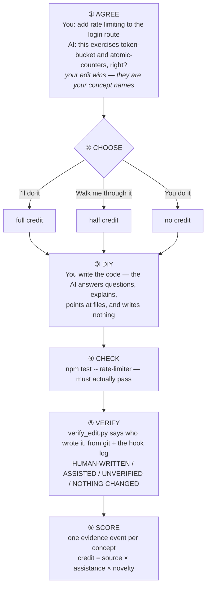

# Grit

**An AI assistant that asks whether you want to do the work yourself — and teaches you when the answer is yes.**

When the AI is about to do something, it asks whether you'd rather do it yourself. If you would, it names the skills involved, checks whether you actually have them, offers an interactive tutorial for the gaps, then hands over the task and asks you to justify the result.

Learning lives at the person level (`~/.grit/`), not per project, and surfaces as a dashboard.

The name is the thesis: grit is the opposite of friction-avoidance.

> **Status: the scoring loop works end to end from real repository work.** Do a task yourself, pass its check, and the concept gains a level you did not award yourself. The second evidence source works too: the assistant writes a tutorial against a measured gap and completing it scores. What does not exist is any **automation** of that — no library, no cache across machines, no pre-flight validation. The design is specified in [.sdlc/docs/DESIGN.md](.sdlc/docs/DESIGN.md); the reasoning and rejected alternatives are in [.sdlc/docs/adr/](.sdlc/docs/adr/README.md). **Read [ADR 0012](.sdlc/docs/adr/0012-profile-validity-is-the-critical-path.md) before building anything** — it names the assumption that everything else rests on.

---

## The problem

AI assistants optimize for throughput. The path of least resistance is to let the AI write everything — which feels productive and quietly erodes skill.

Three results support this, strongest first:

- **Bastani et al., [PNAS 2025](https://www.pnas.org/doi/10.1073/pnas.2422633122)** — ~1,000 students, three arms. Unrestricted GPT access caused **−17% on an unassisted exam**; a **guardrailed tutor eliminated the harm**. Causal and peer-reviewed.
- **METR, [2025](https://arxiv.org/abs/2507.09089)** — RCT, 16 experienced OSS developers, 246 tasks on their own repos. AI made them **19% slower** while they believed it made them **20% faster**.
- **Shen & Tamkin, [2026](https://arxiv.org/abs/2601.20245)** — 52 **novice** developers learning an unfamiliar library. AI impaired conceptual understanding and debugging, with **no significant average efficiency gain**.

Cited deliberately as a counterweight: [Cui et al., Management Science 2025](https://pubsonline.informs.org/doi/10.1287/mnsc.2025.00535) — 4,867 developers, **+26% task completion**. AI helps throughput. Our claim is narrower: throughput and skill are separate outcomes, and only one is currently measured.

---

## The workflow

**Agree the concepts → choose how → you write it → check → verify who wrote it → score.**



**You do not have to be trusted for any of this.** The hook observes every byte the assistant writes, so the `assistance` coefficient is measured rather than declared. If the AI wrote it, the concept earns zero whatever anyone intended.

## The score

`credit = source_weight × assistance × novelty`, summed per concept and capped at 1.0.

| Factor | Values | Why |
|---|---|---|
| source | repo **0.5** · sandbox **0.2** | shipping it beats an exercise about it |
| assistance | none **1.0** · partial **0.5** · full **0.0** | if the AI wrote it, it earns nothing |
| novelty | `1/(1+repeats)`, capped at **1.5× weight per task** | repetition is practice, not new evidence |

`unproven` → **recall** at 0.30 → **proven** at 0.80 *and at least two distinct unaided repository tasks*.

```
1 unaided repo task              0.50  recall
+ same tutorial ground 6x        0.80  recall   ← capped; grinding cannot prove
+ a task the AI wrote            0.80  recall   ← contributes exactly 0
+ a 2nd distinct unaided task    1.00  proven
```

Failures subtract. Evidence older than 90 days counts half. A number that can only rise is not a measurement — see [ADR 0009](.sdlc/docs/adr/0009-graded-score-from-capped-evidence.md).

## The dashboard

The dashboard is the entry gate, not a status page ([ADR 0001](.sdlc/docs/adr/0001-measure-the-effect.md)). It opens on first run, asks what to call you and which theme you want, and applies each theme live as you click it.

Six themes — **Dungeon** (torchlit amber), **Terminal** (green phosphor and scanlines), **Synthwave** (neon magenta and cyan), **Forest** (moss and bark), **Arcade** (high contrast), **Paper** (light and printed). Animations can be turned off. The choice is stored in `~/.grit/preferences.json` and changeable any time from **Settings**.

It reads as a game — rank badges, concept cards, a proficiency panel — and it deliberately has **no XP, no streaks, and nothing to grind.** There is a score, but it is *derived* from evidence rather than accumulated, recomputed on every read, and it can go *down*. A number you add to is a number you can farm, and a farmed record proves nothing.

```bash
python3 skills/grit/serve.py --root ~/.grit     # prints its URL; also written to ~/.grit/daemon.json
```

## Install

**Primary targets: Claude Code and zrb.** The skill is runtime-neutral, so it installs to any assistant that reads a `skills/` directory.

```bash
bin/install.sh                            # auto-detect — install to tools already on this machine
bin/install.sh --claude                   # Claude Code only
bin/install.sh --zrb                      # zrb only
bin/install.sh --tools codex,cursor       # specific tools (comma-separated)
bin/install.sh --tools all                # all 31 known tools
bin/install.sh --no-hook                  # skill only, skip the hook
bin/install.sh --dry-run --tools cursor   # preview, change nothing
bin/install.sh --uninstall --tools all    # remove
bin/install.sh --doctor                   # check every registration on this machine
bin/install.sh --here                     # project-scoped, no changes under ~
```

Portable bash (works on macOS's bash 3.2). Replaces any prior copy, never touches skills that are not `grit`, and **verifies what it installed** — the daemon, scoring and hook self-checks must all pass or it exits non-zero rather than leaving you a half-working tool. A docs-drift check also runs and warns, but does not block an install.

### The skill installs everywhere; the hook does not

The skill goes to `<dotdir>/skills/grit/` for every target — zrb, Claude Code, Codex, OpenCode, Cursor, Windsurf, Copilot, Gemini CLI, Cline and 20+ more.

The hook needs a `PreToolUse` mechanism, which only some runtimes have:

| Runtime | Hook registered in | Format |
|---|---|---|
| Claude Code | `~/.claude/settings.json` | nested `hooks.PreToolUse` block |
| zrb | `~/.zrb/hooks.json` | zrb's native hook array |
| everything else | — | skill works; no prompt, and authorship is `UNVERIFIED` |

Both are merged, not overwritten — existing hooks and settings are preserved, and a backup is taken first. The installer says plainly which targets got no hook rather than pretending they did.

> zrb also reads `~/.claude/settings.json` for Claude compatibility, so on a machine with both, one edit reaches the hook twice. The hook de-duplicates inside a 2-second window, so authorship is still counted once — the same guard covers a user-level and project-level install both firing.

Manual install, if you prefer:

```bash
mkdir -p ~/.zrb/skills && cp -R skills/grit ~/.zrb/skills/       # zrb
mkdir -p ~/.claude/skills && cp -R skills/grit ~/.claude/skills/ # Claude Code
# any other tool — same pattern: <dotdir>/skills/
```

Your measured profile always lives in `~/.grit`, whatever runtime you use: proficiency belongs to the person, not the tool and not the repo.

### Without the hook, what degrades

The teaching loop is unaffected — tutorials, the three gates, the ledger, the profile and the dashboard all run off the daemon. Two things are lost, and the second is the important one:

1. **Authorship is no longer observed.** `verify_edit.py` still proves *what* changed, from git, and reports `UNVERIFIED` rather than guessing *who* wrote it. An honest gap, not a silent one.
2. **The moment is gone.** With no `PreToolUse`, grit only activates when the model judges it relevant or you invoke it — which turns "you are asked every time" into an opt-in mode. That is precisely the shape Kapoor et al. measured failing (N=885: 50% took the bypass, most often the people who needed the friction). On a runtime without a hook, grit is a good tutor; it is not the thing it claims to be.

### Try it without installing

Point the runtime at this repo. **Run this from the grit checkout** — it fills in the absolute path itself rather than asking you to substitute one:

```bash
bin/install.sh --here          # writes .zrb/hooks.json + .claude/skills symlink, project-scoped
```

Undo with `bin/install.sh --here --uninstall`.

> An earlier version of this section was a copy-paste block containing the literal placeholder `/ABSOLUTE/PATH/TO/grit/hooks/grit-hook.py` inside a quoted heredoc, so pasting it produced a hook pointing at a path that does not exist. Because a missing script makes Python exit 2 — the same code both runtimes read as *block this tool call* — that config silently broke **every file write in the project** until someone read the config by hand. Hence `--here`, and hence the `|| exit 0` guard now on every registration.

Check any machine at any time:

```bash
bin/install.sh --doctor        # every registration, and whether its script actually exists
```

### The hook

It fires on every tool call that can write a file — `Write`, `Edit`, `NotebookEdit`, `Bash`, `PowerShell` — and does two things:

1. **Records who wrote the code**, to `~/.grit/projects/<project-key>/authorship.jsonl` — keyed by the project's path, not stored inside it. Edits (`Write`, `Edit`, `NotebookEdit`) are recorded exactly, with line counts. Shell calls (`Bash`, `PowerShell`) are recorded as **opaque** — an assistant can write files with `python3 - <<EOF` or `sed -i`, and nothing observes what those touched. Recording the call without a line count is weaker than seeing the edit, but "something unattributable happened" is true and silence is not: without this, shell-written code reads as human-written.
2. **Asks once per session**, the first time the assistant reaches for the editor. Once. A prompt on every edit is how a tool gets uninstalled.

Turn it off three ways: `grit-hook.py --off` from inside a project, `GRIT_OFF=1` everywhere, or `"ask_on_first_edit": false` in `~/.grit/preferences.json` (which keeps the recording and drops the prompt). A `touch .grit/off` written before the upgrade still counts — installing a new version never silently re-enables a recording you stopped.

## Try it

```bash
python3 skills/grit/serve.py --root ~/.grit --daemon   # detached; survives closing the shell
python3 skills/grit/serve.py --root ~/.grit --stop     # stop it
```

Open the URL it prints. You will get the onboarding gate and a dashboard with **nothing in it**, which is the honest state — see below for why.

```bash
python3 skills/grit/test_serve.py    # 13 integrity properties
python3 hooks/test_hook.py           # 19 hook properties
python3 skills/grit/score.py selftest  # 18 scoring properties
python3 bin/check_docs.py            # every factual claim in these docs
```

## What you can actually do with this today

**You can measure who wrote your code.** Install it, work normally, and the hook records every edit the assistant makes — including shell writes, as unattributable. `verify_edit.py` then tells you, per task, whether a change was human-written, assisted, or unverifiable. That part is real, tested, and useful on its own.

**You can earn a score from real work.** Do a task yourself, pass its check, and the concept gains a level you did not award yourself:

```
concept level  ←  evidence.jsonl  ←  a repository task you did unaided   ✅ works today
                                  ←  a completed tutorial                ✅ written on demand
```

**The second evidence source is slow, not missing.** The assistant authors a tutorial from `skills/grit/tutorial.template.html` — concept text plus a differential check — and completing it scores. That has been run end to end. What is missing is the automation around it: nothing batches or caches tutorials, nothing shares them between machines, and nothing validates a page before it is served except the self-test the assistant wrote into it.

| Piece | State |
|---|---|
| Authorship hook, `verify_edit` | **works** |
| Scoring from real repository tasks | **works** — this is the product |
| Daemon, gates, ledger integrity | **works** |
| Dashboard, themes, auto-refresh | **works** |
| Tutorial runtime, and tutorials written on demand | **works** — verified end to end |
| Onboarding battery, router | **do not exist** — and ADR 0009 removed the need for them to exist first |

Read that as: the measurement substrate is built and both evidence sources work; what is thin is everything around the second one. The remaining build work is automation — batching, caching and validating tutorials rather than writing each by hand. The remaining *risk* is validity — nothing has tested whether a `proven` concept predicts real capability, which is [ADR 0012](.sdlc/docs/adr/0012-profile-validity-is-the-critical-path.md)'s question, restated for a scored profile rather than a battery.

## Documentation

| Path | What it is |
|------|-----------|
| [AGENTS.md](AGENTS.md) | **Conventions for working here** — the ones you cannot infer from the code |
| [.sdlc/docs/ARCHITECTURE.md](.sdlc/docs/ARCHITECTURE.md) | **How it works** — the three processes, the files, the invariants |
| [.sdlc/docs/DESIGN.md](.sdlc/docs/DESIGN.md) | **Why it is shaped this way** — principles, scope, the privacy boundary, what is unproven |
| [.sdlc/docs/adr/](.sdlc/docs/adr/README.md) | **Decision records** — why the design is this way, and what was rejected |
| [.sdlc/docs/LANDSCAPE.md](.sdlc/docs/LANDSCAPE.md) | Competing products, supporting evidence in tiers, the gaps |
| [.sdlc/docs/USAGE.md](.sdlc/docs/USAGE.md) | Historical: a worked example of the original flow (superseded) |
| [ADR 0008](.sdlc/docs/adr/0008-dashboard-polls-files-it-does-not-push.md) | **The data path**, as a diagram — onboarding → day-to-day → dashboard |
| [.sdlc/docs/dev-fixtures.md](.sdlc/docs/dev-fixtures.md) | Props for exercising the runtime — not user instructions |
| [bin/install.sh](bin/install.sh) | Multi-runtime installer — zrb, Claude Code, and 29 more |
| [hooks/](hooks/) | The `PreToolUse` hook and its self-check |
| `bin/install.sh --doctor` | Finds broken or unguarded hook registrations anywhere on the machine |
| [skills/grit/](skills/grit/SKILL.md) | The skill, plus `serve.py`, `dashboard.html`, `test_serve.py` |

---

## What v1 does

- **Authorship recording** — every byte the assistant writes, including opaque shell calls *(built)*
- **`verify_edit.py`** — who wrote it, from git plus the authorship log *(built)*
- **Graded scoring** — per-concept levels from capped evidence *(built)*
- **DIY mode** — the assistant answers but does not write; enforced by the record, not by trust *(built)*
- **Acceptance checks** — command/test; a task scores on a pass, not on your say-so *(built)*
- **Dashboard** — authorship, proficiency, six themes, auto-refresh *(built)*
- **Tutorials as a second evidence source** — the runtime and the authoring path both work *(built)*; **no automation around them**

**Not in v1:** team or hosted features, non-coding domains, cross-user benchmarking, a tutorial library, and any claim beyond harm avoidance.

---

## Two things to know before contributing

**The honest claim.** This design may **avoid harm**. It does not claim to make anyone more skilled. Bastani et al.'s guardrailed arm was statistically indistinguishable from control — not better. No study shows a tool producing skill *gains* over working unaided.

**The unproven assumption.** Everything depends on the profile predicting real-work proficiency. If a `proven` concept does not, the levels are noise and the design collapses to a mirror. This is [ADR 0012](.sdlc/docs/adr/0012-profile-validity-is-the-critical-path.md), which was written about the onboarding battery and has been restated against the score that replaced it. The instrument changed; the question did not.

---

## License

MIT — see [LICENSE](LICENSE).
