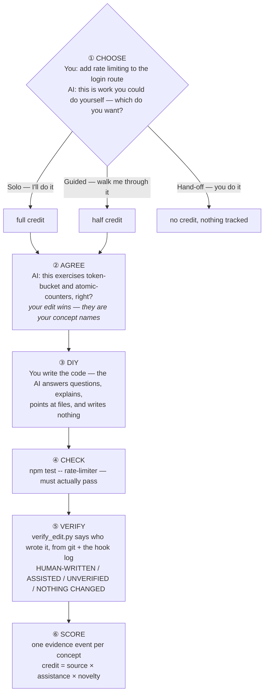

# Grit

**An AI assistant that asks whether you want to do the work yourself — and teaches you when the answer is yes.**

When the AI is about to do something, it asks whether you'd rather do it yourself. If you would, it names the skills involved, checks whether you actually have them, offers an interactive tutorial for the gaps, then hands over the task and asks you to justify the result. What you learn is recorded per person (`~/.grit/`), not per project, and shown on a dashboard.

The name is the thesis: grit is the opposite of friction-avoidance.

> **Status:** the scoring loop works end to end. Do a task yourself, pass its check, and the concept gains a level you did not award yourself; a tutorial the assistant writes against a measured gap scores too. What is missing is automation around tutorials, and — the real risk — any evidence that a `shipped` level predicts real capability. Read [ADR 0012](.sdlc/docs/adr/0012-profile-validity-is-the-critical-path.md) before building anything.

---

## The problem

AI assistants optimize for throughput. The path of least resistance is to let the AI write everything — which feels productive and quietly erodes skill.

Three results support this, strongest first:

- **Bastani et al., [PNAS 2025](https://www.pnas.org/doi/10.1073/pnas.2422633122)** — ~1,000 students, three arms. Unrestricted GPT access caused **−17% on an unassisted exam**; a **guardrailed tutor eliminated the harm**. Causal and peer-reviewed.
- **METR, [2025](https://arxiv.org/abs/2507.09089)** — RCT, 16 experienced OSS developers, 246 tasks on their own repos. AI made them **19% slower** while they believed it made them **20% faster**.
- **Shen & Tamkin, [2026](https://arxiv.org/abs/2601.20245)** — 52 **novice** developers learning an unfamiliar library. AI impaired conceptual understanding and debugging, with **no significant average efficiency gain**.

Cited deliberately as a counterweight: [Cui et al., Management Science 2025](https://pubsonline.informs.org/doi/10.1287/mnsc.2025.00535) — 4,867 developers, **+26% task completion**. AI helps throughput. Our claim is narrower: throughput and skill are separate outcomes, and only one is currently measured.

**The honest ceiling.** This design may **avoid harm**. It does not claim to make anyone more skilled — Bastani et al.'s guardrailed arm was statistically indistinguishable from control, not better, and no study shows a tool producing skill *gains* over working unaided.

---

## The workflow

**Choose how → agree the concepts → you write it → check → verify who wrote it → score.**


```mermaid
flowchart TD
    B{"① CHOOSE<br/>You: add rate limiting to the login route<br/>AI: this is work you could do yourself — which do you want?"}
    B -->|"Solo — I'll do it"| F["full credit"]
    B -->|"Guided — walk me through it"| H["half credit"]
    B -->|"Hand-off — you do it"| N["no credit, nothing tracked"]
    F --> A
    H --> A
    A["② AGREE<br/>AI: this exercises token-bucket and atomic-counters, right?<br/><i>your edit wins — they are your concept names</i>"] --> C
    C["③ DIY<br/>You write the code — the AI answers questions, explains,<br/>points at files, and writes nothing"] --> D["④ CHECK<br/>npm test -- rate-limiter — must actually pass"]
    D --> E["⑤ VERIFY<br/>verify_edit.py says who wrote it, from git + the hook log<br/>HUMAN-WRITTEN / ASSISTED / UNVERIFIED / NOTHING CHANGED"]
    E --> G["⑥ SCORE<br/>one evidence event per concept<br/>credit = source × assistance × novelty"]
```

**You do not have to be trusted for any of this.** The hook observes every byte the assistant writes, so the `assistance` coefficient is measured rather than declared. If the AI wrote it, the concept earns zero whatever anyone intended.

## How to use it

Install it, then mostly forget it: the hook raises the offer the first time the assistant reaches for your editor in a session, once. Everything below is for when you want to drive.

**Ask for the work, and say you want it.** No command — plain words in ordinary work:

> *let's add the retry backoff — I'll write it myself*

The assistant offers solo, guided or hand-off — pre-selecting *guided* only for a concept you have a recorded miss on — names the concepts it thinks the task exercises, you correct them, you write the code, your test decides, and git plus the hook log decide who typed it. Say *just do it* instead and it will, and nothing is scored. That is a legitimate answer; it only has to be a chosen one.

**Learn something you have never touched.** You need something a check can decide, not a repository:

> *I want to learn assembly — I have no experience*

You get an ordered list of concepts and **one** exercise against the first, with a real check — each later exercise is written when you reach it. Exercises top out at `practised` however many you do: `shipped` needs two distinct unaided tasks in a real repository, because nothing else shows you can do it in your own stack.

Ask for something with no oracle — *teach me project management* — and it will decline, say why, and then help you normally, untracked. It cannot check it, so it will not pretend to measure it.

**See where you stand.** `/grit` reports whether the hook is registered on this machine, what the assistant has written in this project, and the dashboard link. It does not start a task.

**Correct a record you think is wrong.** You cannot, and that is the design. There is no edit and no override; the remedy is another measurement. This holds when the assistant got it wrong too — that is the exact case an audit trail exists for.

**Turn it off.** `GRIT_OFF=1` everywhere; `python3 hooks/grit-hook.py --off` from inside one project; or `"ask_on_first_edit": false` in `~/.grit/preferences.json` to keep the recording and drop the prompt. A `touch .grit/off` made before the upgrade still counts — installing a new version never re-enables a recording you stopped.

## The score

`credit = source_weight × assistance × novelty`, summed per concept and capped at 1.0.

| Factor | Values | Why |
|---|---|---|
| source | repo **0.5** · sandbox **0.2** | shipping it beats an exercise about it |
| assistance | none **1.0** · partial **0.5** · full **0.0** | if the AI wrote it, it earns nothing |
| novelty | `1/(1+repeats)`, capped at **1.5× weight per task** | repetition is practice, not new evidence |

`learning` → **practised** at 0.30 → **shipped** at 0.80 *and at least two distinct unaided repository tasks*.

```
1 unaided repo task              0.50  practised
+ same tutorial ground 6x        0.80  practised   ← capped; grinding cannot prove
+ a task the AI wrote            0.80  practised   ← contributes exactly 0
+ a 2nd distinct unaided task    1.00  shipped
```

Failures subtract 0.25. Evidence older than 90 days counts half. A number that can only rise is not a measurement — see [ADR 0009](.sdlc/docs/adr/0009-graded-score-from-capped-evidence.md).

## The dashboard

```bash
python3 skills/grit/serve.py --root ~/.grit --daemon   # detached; prints its URL, also in ~/.grit/daemon.json
python3 skills/grit/serve.py --root ~/.grit --stop     # stop it
```

A fresh install shows a dashboard with **nothing in it**, which is the honest state: nothing has been measured yet. The first visit asks what to call you and offers six themes — **Dungeon**, **Terminal**, **Synthwave**, **Forest**, **Arcade**, **Paper** — applied live as you click. **Settings** also holds tutorial depth and style, whether work defaults to you writing it, and an animations toggle, all stored in `~/.grit/preferences.json`.

It shows three things. **Written by the assistant** — lines, edits and shell calls per project, and how many offered sessions you took over. It never shows a percentage: your own edits are not observed, so there is no denominator. **Tasks you took on** — every handed-over task's verdict (you wrote it, the assistant helped, or unverifiable) with git's count of what changed. **Proficiency** — concept cards ordered by what needs work; every card that is not `shipped` says in one sentence what would prove it, and a card whose evidence is about to start halving says when.

It reads as a game — rank badges, concept cards — and has **no XP, no streaks, and nothing to grind.** The score is *derived* from evidence on every read and can go *down*. A number you add to is a number you can farm, and a farmed record proves nothing.

## Install

**Primary targets: Claude Code and zrb.** The skill is runtime-neutral, so it installs to any assistant that reads a `skills/` directory.

```bash
bin/install.sh                            # auto-detect — install to tools already on this machine
bin/install.sh --claude                   # Claude Code only
bin/install.sh --zrb                      # zrb only
bin/install.sh --tools codex,cursor       # specific tools (comma-separated)
bin/install.sh --tools all                # all 31 known tools
bin/install.sh --no-hook                  # skill only, skip the hook
bin/install.sh --dry-run --tools cursor   # preview, change nothing
bin/install.sh --uninstall --tools all    # remove
bin/install.sh --doctor                   # check every hook registration on this machine
bin/install.sh --here                     # this project only: .zrb/hooks.json + .claude/skills link, real paths filled in
bin/install.sh --here --uninstall         # undo --here
```

Portable bash (works on macOS's bash 3.2). It replaces any prior copy, never touches skills that are not `grit`, and **verifies what it installed** — the daemon, scoring and hook self-checks must all pass or it exits non-zero. A docs-drift check also runs and warns without blocking. Manual install is `cp -R skills/grit <dotdir>/skills/` for any tool, but you then wire the hook yourself.

### The skill installs everywhere; the hook does not

The skill goes to `<dotdir>/skills/grit/` for every target — zrb, Claude Code, Codex, OpenCode, Cursor, Windsurf, Copilot, Gemini CLI, Cline and 20+ more. The hook needs a `PreToolUse` mechanism, which only some runtimes have:

| Runtime | Hook registered in | Format |
|---|---|---|
| Claude Code | `~/.claude/settings.json` | nested `hooks.PreToolUse` and `hooks.PostToolUse` blocks |
| zrb | `~/.zrb/hooks.json` | zrb's native hook array, both events |
| everything else | — | skill works; no prompt, and authorship is `UNVERIFIED` |

Configs are merged, never overwritten, and backed up first; every registration is guarded with `|| exit 0` so a broken hook can never block a tool call ([ADR 0007](.sdlc/docs/adr/0007-hooks-must-fail-open.md)). zrb also reads `~/.claude/settings.json`, so on a machine with both, one edit reaches the hook twice; the hook de-duplicates identical events, so authorship is still counted once.

**Without the hook**, tutorials, gates, ledger, profile and dashboard all still work. Two things are lost. Authorship is no longer observed, so `verify_edit.py` reports `UNVERIFIED` rather than guessing. And the moment is gone: grit only activates when the model judges it relevant or you invoke it, which turns "you are asked every time" into an opt-in mode — the shape Kapoor et al. measured failing (N=885: 50% took the bypass, most often those who needed the friction). On a runtime without a hook, grit is a good tutor; it is not the thing it claims to be.

**Uninstall removes grit and nothing else** — its skill directory and hook registration. Other skills, the runtime's own `skills/` directory and the rest of your `settings.json` are left alone; the file is deleted only when grit's hook was the one thing in it. **`~/.grit` survives on purpose**: uninstalling is not how you correct a record. `rm -rf ~/.grit` is yours to run, and the installer says so.

### What the hook does

It fires before every tool call that can write a file — `Write`, `Edit`, `NotebookEdit`, `Bash`, `PowerShell` — and after every file edit, and does three things:

1. **Records who wrote the code**, to `~/.grit/projects/<project-key>/authorship.jsonl` — keyed by the project's path, not stored inside it. Edits are recorded exactly, with line counts. Shell calls are **watched**: an assistant can write files with `python3 - <<EOF` or `sed -i`, so the hook fingerprints the working tree before and after each one and records exactly which files it wrote. A shell call that wrote nothing — running your tests — costs you nothing; one that wrote a file makes the task assisted and names the file. A call whose "after" was never seen stays **opaque**, and the task stays unverified rather than reading as human-written.
2. **Asks once per session**, the first time the assistant reaches for the editor. A prompt on every edit is how a tool gets uninstalled.
3. **Confirms edits that ran** (`PostToolUse`), which is how the dashboard knows you declined the offer rather than approved it.

## What works today

| Piece | State |
|---|---|
| Authorship hook and `verify_edit.py` — who wrote it, from git plus the hook log | **works** |
| Graded scoring from real repository tasks — this is the product | **works** |
| DIY mode — the assistant answers but does not write, enforced by the record | **works** |
| Daemon, three-gate ledger, dashboard, themes, auto-refresh | **works** |
| Tutorials written on demand, with optional traces, non-JS exercises and predict-before-you-run | **works** — verified end to end |
| Automation around tutorials — batching, caching, sharing, pre-validation | **does not exist** |
| Router — pre-selects *guided* only where a failure was recorded | **works**, as one rule |
| Onboarding battery and per-concept probe | **deferred** — [ADR 0011](.sdlc/docs/adr/0011-routing-on-a-measured-profile-deferred.md) |

**Not planned:** team or hosted features, anything without an executable oracle, cross-user benchmarking, a tutorial library, and any claim beyond harm avoidance.

The remaining build work is automation. The remaining *risk* is validity: nothing has tested whether a `shipped` concept predicts real capability. If it does not, the levels are noise and the design collapses to a mirror of who typed what — [ADR 0012](.sdlc/docs/adr/0012-profile-validity-is-the-critical-path.md).

## Documentation

| Path | What it is |
|------|-----------|
| [AGENTS.md](AGENTS.md) | **Contributing** — conventions you cannot infer from the code, and the self-checks to run |
| [CHANGELOG.md](CHANGELOG.md) | What changed, release by release |
| [.sdlc/docs/ARCHITECTURE.md](.sdlc/docs/ARCHITECTURE.md) | **How it works** — the three processes, the files, the invariants |
| [.sdlc/docs/DESIGN.md](.sdlc/docs/DESIGN.md) | **Why it is shaped this way** — principles, scope, privacy, what is unproven |
| [.sdlc/docs/adr/](.sdlc/docs/adr/README.md) | **Decision records** — each decision and what was rejected |
| [.sdlc/docs/LANDSCAPE.md](.sdlc/docs/LANDSCAPE.md) | Competing products, supporting evidence in tiers |
| [.sdlc/docs/dev-fixtures.md](.sdlc/docs/dev-fixtures.md) | Props for exercising the runtime — not user instructions |
| [skills/grit/SKILL.md](skills/grit/SKILL.md) | What the assistant does at runtime |

## License

MIT — see [LICENSE](LICENSE).
