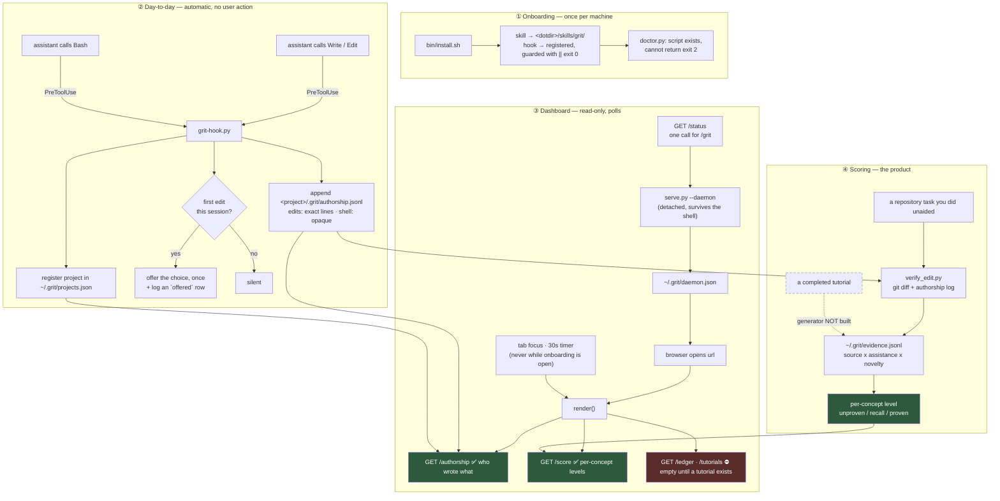

# ADR 0013 — The dashboard polls files; nothing pushes, and the page leads with what works

- **Status**: Accepted
- **Date**: 2026-09-13
- **Deciders**: Go Frendi
- **Context tags**: dashboard, data-flow, ux, availability

## Context

Three separate processes write and read grit's state, and until now no document said how they connect. That gap produced real defects rather than confusion alone:

- The dashboard fetched `/profile`, `/ledger` and `/tutorials` — all three structurally empty at the time — and **never read `.grit/authorship.jsonl`**, the only file with data in it. The working feature was invisible on its own dashboard. (Since [ADR 0014](0014-graded-score-from-capped-evidence.md) the profile is fed by repository work and is no longer empty.)
- The page fetched once at load and never again, so it went stale the moment you started working.
- The daemon ran in the foreground of whatever shell started it and died with that shell, which meant closing a terminal 404'd your own data.
- The headline figure was a ring reading `0% proven+`, derived from a profile that [ADR 0002's addendum](0002-required-profile-with-decay.md) establishes cannot be populated. The most prominent number on the page could never move.

## Decision

> The dashboard is a **poll-over-files view**. The hook appends to per-project JSONL, the daemon aggregates those files per request, and the page re-fetches on tab focus and every 30 seconds. Nothing pushes. The page leads with authorship — the measurement that exists — and the unbuilt teaching loop is collapsed behind a disclosure.

## The data path

## Rationale

- **Polling is correct for this shape.** The writer is a short-lived hook process that exits immediately; it has nowhere to hold a connection. Files are the natural handoff, and a 30-second refresh against a local file costs nothing.
- **`~/.grit/projects.json` is the missing link.** The log is per-project and the dashboard is per-person, so without a registry of projects the daemon cannot find the data. The hook writes that pointer as it records.
- **Authorship leads because it is the only thing that works.** A layout that gives top billing to a permanently-zero metric tells the user the product is broken. `ADR 0004` said the dashboard is the entry gate; this makes the gate show something true.
- **An `offered` row makes the prompt mean something.** Sessions where the choice was offered and no assistant edit followed are the only evidence this product has that anyone chose to do the work. It is an inference, not an observation — the runtime does not report the answer back — and is labelled as such.

## Consequences

- **Up to 30 seconds of staleness**, and none while the setup dialog is open — re-rendering under someone typing their name is worse than stale data.
- **`serve.py` must be restarted after editing it**; `dashboard.html` is read per request and needs no restart. This bit during development and is worth remembering.
- **`--daemon` detaches and `--stop` reads the pid from `daemon.json`.** A `kill -9` leaves that file pointing at a dead port, so readers must treat it as a hint.
- **`/status` exists so `/grit` costs one request**, not several shell round-trips.
- **The unbuilt panels still ship**, collapsed and labelled. Hiding them entirely would misstate the product as finished; leading with them misstated it as broken.

## Alternatives Considered

- **Server-sent events from the daemon** — rejected. The daemon does not know when the hook wrote; it would have to watch the filesystem to push, which is strictly more machinery than a timer.
- **The hook POSTs to the daemon directly** — rejected. It would make every edit depend on the daemon being up, and the hook must never be able to interfere with editing (ADR 0012).
- **Hide the unbuilt panels entirely** — rejected; see Consequences.
- **Keep the ring, showing authorship as a percentage** — rejected. There is no denominator: the human's own edits are not observed. `verify_edit.py` gets a real one per task from git; the dashboard must not invent one.

## Backlinks

- [ADR index](index.md)
- [ADR 0002 — Required profile](0002-required-profile-with-decay.md) (addendum: why the profile is empty)
- [ADR 0004 — Measure the effect](0004-measure-the-effect.md)
- [ADR 0012 — Hooks must fail open](0012-hooks-must-fail-open.md)
